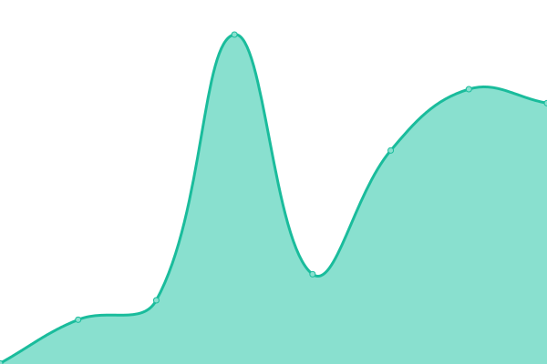
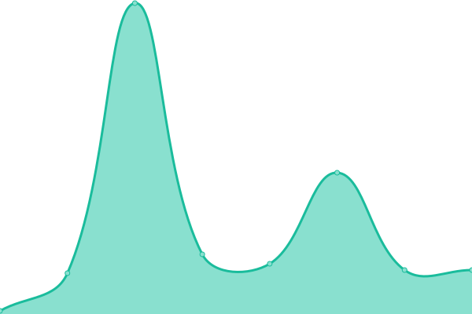

# [📈 Live Status](https://ymmmtym.com): <!--live status--> **🟩 All systems operational**

This repository contains the open-source uptime monitor and status page for [ymmmtym](https://ymmmtym.com/), powered by [Upptime](https://github.com/upptime/upptime).

With [Upptime](https://upptime.js.org), you can get your own unlimited and free uptime monitor and status page, powered entirely by a GitHub repository. We use [Issues](https://github.com/ymmmtym/upptime/issues) as incident reports, [Actions](https://github.com/ymmmtym/upptime/actions) as uptime monitors, and [Pages](https://ymmmtym.com) for the status page.

<!--start: status pages-->
<!-- This summary is generated by Upptime (https://github.com/upptime/upptime) -->
<!-- Do not edit this manually, your changes will be overwritten -->
<!-- prettier-ignore -->
| URL | Status | History | Response Time | Uptime |
| --- | ------ | ------- | ------------- | ------ |
|  [Google](https://www.google.com) | 🟩 Up | [google.yml](https://github.com/ymmmtym/upptime/commits/HEAD/history/google.yml) | 

 76ms
     
 | 

<a href="https://ymmmtym.github.io/upptime/history/google">100.00%</a>
    

|  [Wikipedia](https://en.wikipedia.org) | 🟩 Up | [wikipedia.yml](https://github.com/ymmmtym/upptime/commits/HEAD/history/wikipedia.yml) | 

 191ms
     
 | 

<a href="https://ymmmtym.github.io/upptime/history/wikipedia">100.00%</a>
    

|  [Hacker News](https://news.ycombinator.com) | 🟩 Up | [hacker-news.yml](https://github.com/ymmmtym/upptime/commits/HEAD/history/hacker-news.yml) | 

 983ms
     
 | 

<a href="https://ymmmtym.github.io/upptime/history/hacker-news">99.05%</a>
    

|  [Test for HEAD](https://www.google.com) | 🟩 Up | [test-for-head.yml](https://github.com/ymmmtym/upptime/commits/HEAD/history/test-for-head.yml) | 

 16ms
     
 | 

<a href="https://ymmmtym.github.io/upptime/history/test-for-head">100.00%</a>
    

|  [keywoo](https://keywoo.yumenomatayume.net/) | 🟩 Up | [keywoo.yml](https://github.com/ymmmtym/upptime/commits/HEAD/history/keywoo.yml) | 

 639ms
     
 | 

<a href="https://ymmmtym.github.io/upptime/history/keywoo">100.00%</a>
    

<!--end: status pages-->

[**Visit our status website →**](https://ymmmtym.com)

## 📄 License

- Powered by: [Upptime](https://github.com/upptime/upptime)
- Code: [MIT](./LICENSE) © [ymmmtym](https://ymmmtym.com/)
- Data in the `./history` directory: [Open Database License](https://opendatacommons.org/licenses/odbl/1-0/)
